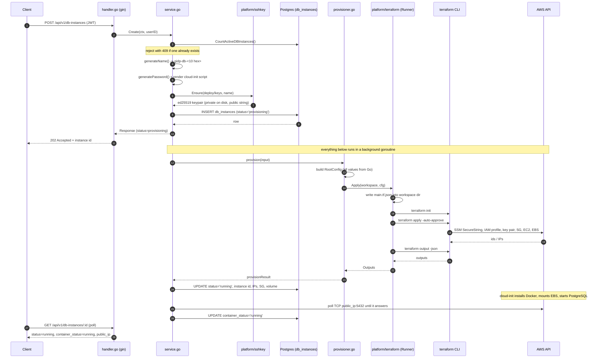

# DB Instance Provisioning — How It Works

This document explains the **Database module** end to end: what each component does, how they hand off to
each other, and what happens on disk and in AWS when someone calls `POST /api/v1/db-instances`.

The module implements a minimal, cost-efficient RDS-like system: a **DB Instance** is a single EC2 machine
that hosts many PostgreSQL databases inside one Docker container, backed by a persistent EBS volume.

**Only one live DB Instance may exist at a time.** This is enforced both in the service (a count check) and
in Postgres (a unique index over a constant expression, partial on `deleted_at IS NULL`), so a race between
two concurrent requests still cannot produce a second instance. To create a new one, delete the existing
record first — including a `failed` one.

---

## 1. The big picture



The key architectural decision: **Terraform declares resources, Go decides values.** The HCL module contains
no hard-coded region, instance type, name or key. Every input is computed in Go and injected as a generated
JSON root module.

---

## 2. Component map

| Layer | Path | Responsibility |
| --- | --- | --- |
| HTTP | [internal/modules/dbinstance/handler.go](../internal/modules/dbinstance/handler.go) | Routes, auth context, error → HTTP status mapping |
| Business logic | [internal/modules/dbinstance/service.go](../internal/modules/dbinstance/service.go) | Naming, key lifecycle, DB state machine, background orchestration |
| Infra translation | [internal/modules/dbinstance/provisioner.go](../internal/modules/dbinstance/provisioner.go) | Turns a DB instance into a Terraform root module |
| Bootstrap script | [internal/modules/dbinstance/userdata.go](../internal/modules/dbinstance/userdata.go) + [templates/bootstrap.sh.tmpl](../internal/modules/dbinstance/templates/bootstrap.sh.tmpl) | Renders the cloud-init script that installs Docker and starts PostgreSQL |
| Terraform driver | [internal/platform/terraform/runner.go](../internal/platform/terraform/runner.go) | Generic `tfexec` wrapper, workspace isolation, outputs |
| Keys | [internal/platform/sshkey/sshkey.go](../internal/platform/sshkey/sshkey.go) | ed25519 OpenSSH keypair generation/removal |
| Data access | [internal/modules/dbinstance/repository.go](../internal/modules/dbinstance/repository.go) | Thin wrapper over sqlc queries |
| Schema | [db/migrations/00018_create_db_instances.sql](../db/migrations/00018_create_db_instances.sql) | `db_instances` table |
| Queries | [db/queries/db_instances.sql](../db/queries/db_instances.sql) | sqlc query definitions |
| Infrastructure | [deploy/terraform/modules/ec2-instance/main.tf](../deploy/terraform/modules/ec2-instance/main.tf) | The reusable AWS resource definitions |
| Wiring | [internal/server/server.go](../internal/server/server.go) | Builds `dbinstance.Config` from app config, registers routes |
| Settings | [internal/config/config.go](../internal/config/config.go) | Static defaults + env overrides |

---

## 3. Walkthrough of a create

### 3.1 HTTP layer

`POST /api/v1/db-instances` is registered on the **protected** group, so `auth.RequireAuth()` has already
validated the JWT and put the caller's id into the gin context.

The endpoint takes **no request body** — every parameter is static and decided in Go. The handler simply
reads `auth.ContextUserIDKey` and calls the service.

It responds **202 Accepted**, not 201: the row exists, but the AWS resources do not yet. The client polls
`GET /api/v1/db-instances/:id` until `status` becomes `running` or `failed`.

### 3.2 Name and workspace

`generateName()` produces `gidp-db-` + 5 random bytes hex, e.g. `gidp-db-3f9a1c7b02`.

That single string is deliberately used for **three** things:

- the DB instance `name`
- the Terraform `workspace` (the directory name under the work root)
- the AWS `key_name` and the SSH key filename

It is constrained to `^[a-z0-9][a-z0-9-]{0,62}$`, which is simultaneously a valid AWS resource name, a safe
directory name, and the regex the Runner enforces to prevent path traversal.

### 3.3 SSH key pair

`sshkey.Ensure(dir, name)` is idempotent:

1. If `deploy/keys/<name>` and `<name>.pub` both exist, it loads and returns them.
2. Otherwise it generates an **ed25519** key, marshals the private half to OpenSSH PEM
   (`ssh.MarshalPrivateKey`) and writes it with mode `0600`, and writes the authorized-keys form of the
   public half to `<name>.pub`.

Only the **public key string** ever leaves the function toward Terraform. The private key never enters the
database, the API response, or the Terraform state.

`deploy/keys/` is gitignored. To connect later:

```bash
ssh -i deploy/keys/gidp-db-3f9a1c7b02 ec2-user@<public_ip>
```

### 3.4 Database row (the state machine)

The row is inserted **before** any AWS call, so a crash mid-provision still leaves a durable record.

There are **two independent status axes**, because "the machine exists" and "PostgreSQL is usable" are
different facts that become true at different times.

`db_instances.status` — the infrastructure:

```
provisioning ──success──> running
      │                      │
      │ failure              │ DELETE
      ▼                      ▼
   failed                deleting ──success──> deleted (soft, deleted_at set)
                             │
                             └─failure──> failed (status_message holds terraform stderr)
```

`db_instances.container_status` — the PostgreSQL container:

```
pending ──port 5432 answers──> running
   │
   └─readiness timeout / no address──> failed
```

A row can legitimately sit at `status=running, container_status=pending` for a minute or two: the EC2 host is
up but cloud-init is still installing Docker and pulling the Postgres image. Clients should wait for
**`container_status=running`** before trying to connect.

Three unique indexes exist:

- `uq_single_active_db_instance` — a unique index on the constant expression `(true)`, partial on
  `deleted_at IS NULL`. Every live row produces the same key, so Postgres itself permits at most one. This
  is the hard guarantee behind the "only one DB instance" rule; the service's count check is just a nicer
  error message in front of it.
- `uq_db_instance_name` — over `deleted_at IS NULL`, so a name is reusable after deletion.
- `uq_db_instance_workspace` — over **all** rows, because a Terraform state directory must never be reused
  by a second instance even after a soft delete.

### 3.5 The background goroutine

`Create` returns immediately, then `go s.provisionAsync(...)` runs the apply. This matters because
`terraform apply` for an EC2 instance takes 60–120 seconds — far too long to hold an HTTP connection.

The goroutine builds its **own** context:

```go
ctx, cancel := context.WithTimeout(context.Background(), s.cfg.ProvisionTimeout) // 20m default
```

It deliberately does *not* derive from `c.Request.Context()`, which gin cancels the moment the 202 response
is written; that would kill the apply mid-flight.

On failure, the error message is written into `status_message` and the status becomes `failed`. On success,
`MarkDBInstanceProvisioned` writes the EC2 instance id, AZ, public/private IP, security group id and data
volume id in one statement, and then the same goroutine moves on to `awaitPostgres` (see §6.3).

---

## 4. How Go generates Terraform

### 4.1 The generated root module

Terraform accepts configuration in JSON (`*.tf.json`) as a first-class alternative to HCL. The Runner
exploits that: instead of templating HCL text or writing `.tfvars`, the provisioner builds a Go struct and
marshals it.

`provisioner.rootConfig()` produces roughly this file, written to
`deploy/terraform/.workspaces/gidp-db-3f9a1c7b02/main.tf.json`:

```json
{
  "terraform": {
    "required_version": ">= 1.5.0",
    "required_providers": { "aws": { "source": "hashicorp/aws", "version": "~> 5.60" } }
  },
  "provider": { "aws": { "region": "us-east-1" } },
  "module": {
    "db_instance": {
      "source": "../../modules/ec2-instance",
      "name": "gidp-db-3f9a1c7b02",
      "instance_type": "t3.micro",
      "ami_ssm_parameter": "/aws/service/ami-amazon-linux-latest/al2023-ami-kernel-default-x86_64",
      "key_name": "gidp-db-3f9a1c7b02",
      "public_key": "ssh-ed25519 AAAA...",
      "root_volume_size_gb": 10,
      "data_volume_size_gb": 20,
      "postgres_port": 5432,
      "ssh_ingress_cidr": "0.0.0.0/0",
      "postgres_ingress_cidr": "0.0.0.0/0",
      "tags": { "ManagedBy": "gidp", "Component": "db-instance", "Workspace": "gidp-db-3f9a1c7b02" }
    }
  },
  "output": {
    "instance_id": { "value": "${module.db_instance.instance_id}" },
    "public_ip":   { "value": "${module.db_instance.public_ip}" }
  }
}
```

Why JSON generation instead of `terraform.tfvars`:

- No variable declarations have to be duplicated in a root module.
- No string templating, no HCL escaping bugs.
- The provider block (and therefore the region) is itself dynamic, which a `.tfvars` file cannot do.

### 4.2 Why the module source is relative

Terraform only accepts a **local** module source that begins with `./` or `../`; an absolute path is parsed
as a registry address and fails. `provisioner.moduleSource()` therefore computes
`filepath.Rel(workspaceDir, moduleDir)`, giving `../../modules/ec2-instance`.

### 4.3 Workspace isolation

Every DB instance gets its own directory:

```
deploy/terraform/
├── modules/ec2-instance/          # shared, committed HCL
│   ├── main.tf
│   ├── variables.tf
│   └── outputs.tf
└── .workspaces/                   # gitignored, runtime only
    └── gidp-db-3f9a1c7b02/
        ├── main.tf.json           # generated by Go
        ├── .terraform/            # provider plugins
        ├── .terraform.lock.hcl
        └── terraform.tfstate      # state for THIS instance only
```

One state file per instance means instances can be created and destroyed independently and concurrently
without lock contention or blast radius across resources.

### 4.4 The Runner

`terraform.NewRunner(execPath, workRoot, logs)`:

- resolves the `terraform` binary (`TERRAFORM_BIN_PATH`, else `exec.LookPath`),
- creates the work root,
- returns an error if Terraform is missing — the module then starts with provisioning **disabled** rather
  than crashing the server (create/delete return `503`, reads still work).

`Apply(ctx, workspace, cfg)`:

1. validates the workspace name against the regex,
2. writes `main.tf.json` (mode `0600`),
3. `terraform init` (`-upgrade=false`),
4. `terraform apply -auto-approve`,
5. `terraform output -json` and returns `Outputs`.

`Outputs.String(key)` unmarshals the raw JSON output value into a Go string, returning `""` when the output
is absent — so a missing output degrades to an empty column instead of a panic.

The Runner knows nothing about EC2 or databases. Any future module (Redis host, S3 bucket, VPC) can reuse it
by supplying a different `RootConfig`.

---

## 5. What Terraform actually creates

From [deploy/terraform/modules/ec2-instance/main.tf](../deploy/terraform/modules/ec2-instance/main.tf):

| Resource | Purpose |
| --- | --- |
| `data.aws_ssm_parameter.ami` | Resolves the latest Amazon Linux 2023 AMI id at plan time, so no AMI is hard-coded per region |
| `data.aws_vpc.default` / `aws_subnets` / `aws_subnet` | Uses the account's default VPC and its first subnet (sorted for determinism) |
| `aws_key_pair.this` | Registers the generated ed25519 public key |
| `aws_ssm_parameter.admin_password` | **SecureString** holding the PostgreSQL superuser password |
| `aws_iam_role.this` + `aws_iam_role_policy.this` | Lets the instance read *only* that one parameter, and decrypt with `alias/aws/ssm` |
| `aws_iam_instance_profile.this` | Attaches the role to the instance |
| `aws_security_group.this` | Empty shell; rules are separate resources so they can change without recreating the SG |
| `aws_vpc_security_group_ingress_rule.ssh` | TCP 22 from `ssh_ingress_cidr` |
| `aws_vpc_security_group_ingress_rule.postgres` | TCP 5432 from `postgres_ingress_cidr` |
| `aws_vpc_security_group_egress_rule.all` | All outbound (needed to reach SSM and pull the Docker image) |
| `aws_instance.this` | `t3.micro`, encrypted gp3 root volume, **IMDSv2 required**, instance profile and `user_data` attached |
| `aws_ebs_volume.data` | Separate encrypted gp3 volume in the instance's AZ, for the PostgreSQL data dir |
| `aws_volume_attachment.data` | Attaches it at `/dev/sdf` |

**Why a separate data volume?** The root volume has `delete_on_termination = true`; the data volume does
not. The EC2 host can be replaced, resized, or rebuilt without losing PostgreSQL data — this is what makes
the "instance" and the "databases" independent lifecycles, which is the whole point of an RDS-like design.

The AZ is taken from `aws_instance.this.availability_zone` rather than the subnet, which guarantees the
volume and the instance always land in the same AZ (EBS cannot cross AZs).

The instance has an explicit `depends_on` for the SSM parameter and the IAM policy: nothing in the
`user_data` string creates an implicit dependency, and the bootstrap script would fail if it booted before
the password existed or before it was allowed to read it.

---

## 6. Host bootstrap (cloud-init)

### 6.1 Why user_data instead of SSH

The script is rendered in Go and passed to the instance as `user_data`, rather than being executed over SSH
after the apply. That avoids polling for sshd to come up, needs no inbound SSH from the backend, and runs
again automatically if the instance is ever replaced. The SSH key still exists, but purely for humans
debugging the box.

The template lives in
[templates/bootstrap.sh.tmpl](../internal/modules/dbinstance/templates/bootstrap.sh.tmpl) and is compiled
into the binary with `//go:embed`, so there is no runtime file dependency.

### 6.2 What the script does

1. **Installs Docker** (`dnf install -y docker`, `systemctl enable --now docker`) and ensures the AWS CLI is
   present.
2. **Finds the data volume.** This is the subtlest part. The volume is attached *after* the instance
   launches, so at boot it may not exist yet; and t3 is a Nitro instance, so `/dev/sdf` is renamed to
   something like `/dev/nvme1n1`. The script therefore polls `/dev/sdf`, `/dev/xvdf` and `/dev/nvme1n1` for
   up to five minutes and resolves the symlink to the real device.
3. **Formats only if unformatted.** `blkid` is checked first — formatting unconditionally would destroy the
   database every time the host was rebuilt, which would defeat the entire point of a separate volume.
4. **Mounts by UUID** in `/etc/fstab` with `nofail`, never by device name (Nitro device names are not
   stable across reboots).
5. **Fetches the password** from SSM using the instance profile — the password is never in `user_data`,
   which is readable from the metadata service by anything running on the box.
6. **Starts PostgreSQL** with `--restart unless-stopped`, the data directory bind-mounted onto the EBS
   volume, and credentials passed through a `0600` env file rather than `-e` flags (so they do not appear in
   `ps` output inside the instance).

Output is teed to `/var/log/gidp-bootstrap.log`, which is the first place to look if `container_status`
ends up `failed`.

### 6.3 Knowing when it finished

`terraform apply` returns as soon as EC2 reports the instance running — cloud-init is still working at that
point. So `awaitPostgres` in the service TCP-dials `public_ip:5432` every 10 seconds until it answers or
`ReadinessTimeout` (10m) expires, then flips `container_status` to `running` or `failed`.

This is a deliberately dumb check: it proves the port is open and something is listening, not that
authentication works. It is enough for a status field, and it needs no agent on the instance.

---

## 7. Configuration

All values are static defaults in [internal/config/config.go](../internal/config/config.go), overridable by
environment variable. Nothing comes from the API client.

| Env var | Default | Used for |
| --- | --- | --- |
| `AWS_REGION` | `us-east-1` | Provider block region |
| `DB_INSTANCE_TYPE` | `t3.micro` | EC2 instance type |
| `DB_INSTANCE_AMI_SSM_PARAMETER` | AL2023 x86_64 latest | AMI lookup |
| `DB_INSTANCE_ENGINE_VERSION` | `16` | Recorded on the row |
| `DB_INSTANCE_STORAGE_GB` | `20` | Data volume size |
| `DB_INSTANCE_ROOT_VOLUME_GB` | `10` | Root volume size |
| `DB_INSTANCE_POSTGRES_PORT` | `5432` | Security group rule + published container port |
| `DB_INSTANCE_POSTGRES_IMAGE` | `postgres:16-alpine` | Container image |
| `DB_INSTANCE_ADMIN_USERNAME` | `gidp` | PostgreSQL superuser |
| `DB_INSTANCE_CONTAINER_NAME` | `gidp-postgres` | Docker container name |
| `DB_INSTANCE_DATA_DEVICE_NAME` | `/dev/sdf` | EBS attachment point (hint for the device scan) |
| `DB_INSTANCE_DATA_MOUNT_POINT` | `/var/lib/gidp/postgres` | Where the data volume is mounted |
| `DB_INSTANCE_SSH_INGRESS_CIDR` | `0.0.0.0/0` | SSH ingress |
| `DB_INSTANCE_POSTGRES_INGRESS_CIDR` | `0.0.0.0/0` | PostgreSQL ingress |
| `DB_INSTANCE_PROVISION_TIMEOUT` | `20m` | Terraform apply/destroy context timeout |
| `DB_INSTANCE_READINESS_TIMEOUT` | `10m` | How long to wait for the container port |
| `TERRAFORM_BIN_PATH` | *(empty → PATH)* | Terraform binary |
| `TERRAFORM_MODULE_DIR` | `deploy/terraform/modules/ec2-instance` | Shared HCL module |
| `TERRAFORM_WORK_DIR` | `deploy/terraform/.workspaces` | Per-instance state root |
| `SSH_KEY_DIR` | `deploy/keys` | Generated key pairs |

**AWS credentials are never handled by this code.** The AWS provider uses the standard credential chain
(`~/.aws/credentials`, `AWS_PROFILE`, env vars, instance profile), so whatever works for your local
`aws` CLI works here.

---

## 8. Deletion

`DELETE /api/v1/db-instances/:id` mirrors creation:

1. Rejects with `409` if the instance is already `provisioning` or `deleting`.
2. Sets `status = 'deleting'` synchronously, returns **202**.
3. Background goroutine runs `terraform destroy`, then `RemoveWorkspace` (deletes the state directory),
   then soft-deletes the row and removes the key pair files.

Order matters: the workspace and keys are only removed **after** destroy succeeds. If destroy fails, the
state file survives so the teardown can be retried instead of orphaning AWS resources.

Because of the singleton rule, deletion is also how you "recreate" an instance — including after a failed
provision. `terraform destroy` on a partially applied workspace is safe and cleans up whatever was created.

---

## 9. API reference

| Method | Path | Status | Notes |
| --- | --- | --- | --- |
| `POST` | `/api/v1/db-instances` | `202` | No body. `409` if a live instance already exists |
| `GET` | `/api/v1/db-instances` | `200` | All non-deleted instances |
| `GET` | `/api/v1/db-instances/:id` | `200` | Poll this for status |
| `DELETE` | `/api/v1/db-instances/:id` | `202` | Async teardown |

Error mapping (`respondServiceError`): `ErrInvalidID` → 400, `ErrNotFound` → 404, `ErrBusy` and
`ErrAlreadyExists` → 409, `ErrNotConfigured` → 503, anything else → 500 with a generic message (raw errors
are logged, never returned).

Example:

```bash
TOKEN=...   # from POST /api/v1/auth/login

ID=$(curl -s -XPOST localhost:8080/api/v1/db-instances \
      -H "Authorization: Bearer $TOKEN" | jq -r .id)

watch -n5 "curl -s localhost:8080/api/v1/db-instances/$ID \
      -H 'Authorization: Bearer $TOKEN' | jq '{status, container_status, public_ip, status_message}'"
```

Once `container_status` is `running`, connect with the password from SSM:

```bash
PASSWORD=$(aws ssm get-parameter --name /gidp/db-instances/<name>/admin-password \
  --with-decryption --region us-east-1 --query 'Parameter.Value' --output text)

psql "postgres://gidp:$PASSWORD@<public_ip>:5432/postgres"
```

---

## 10. Security notes

- Private keys are written `0600` into a gitignored directory and never appear in the API, logs or DB.
- The PostgreSQL password is generated with `crypto/rand`, stored as an SSM **SecureString**, and read by the
  instance through a role scoped to that single parameter ARN plus `alias/aws/ssm` decryption. It is not in
  `user_data`, not in the API response, and not in the application database.
- `main.tf.json` is written `0600`. Note that `terraform.tfstate` **does** contain the password (an
  unavoidable consequence of Terraform managing the SSM parameter) — it is gitignored and local-only. Moving
  state to an encrypted S3 backend is the natural hardening step.
- Workspace names are regex-validated before being joined onto the work root (path traversal defence).
- IMDSv2 is enforced on the instance, mitigating SSRF-based credential theft.
- Both EBS volumes are encrypted at rest.
- **Default ingress is `0.0.0.0/0` for both SSH and PostgreSQL.** Now that a real superuser is listening on
  5432, narrow `DB_INSTANCE_POSTGRES_INGRESS_CIDR` before using this anywhere but a sandbox account.

---

## 11. Adding a new provisioned resource type

The split exists so this is cheap:

1. Add an HCL module under `deploy/terraform/modules/<name>/` with variables and outputs only.
2. Add a `provisioner.go` in your module that builds a `terraform.RootConfig` pointing at it.
3. Reuse `terraform.Runner` unchanged; give each resource its own workspace name.
4. Follow the same `provisioning → running/failed` status pattern so clients can poll consistently.

---

## 12. Next step (not yet implemented)

The DB Instance now boots with a running PostgreSQL container. What remains is the **second resource** —
`Database`, many per DB Instance — which is deliberately *not* Terraform work:

1. New `databases` table with a `db_instance_id` foreign key.
2. `POST /api/v1/db-instances/:id/databases` connects to the instance with pgx using the SSM password and
   runs `CREATE DATABASE` / `CREATE ROLE`.
3. Per-database role passwords stored as their own SSM SecureStrings, returned once as a connection string.

Running many logical databases in one container on one `t3.micro` is what makes this cost-efficient
compared to one RDS instance per database.

Other worthwhile follow-ups: a startup reconciler for rows stuck in `provisioning` after a crash, start/stop
of the EC2 instance to save cost, and `pg_dump`/EBS-snapshot backups.
